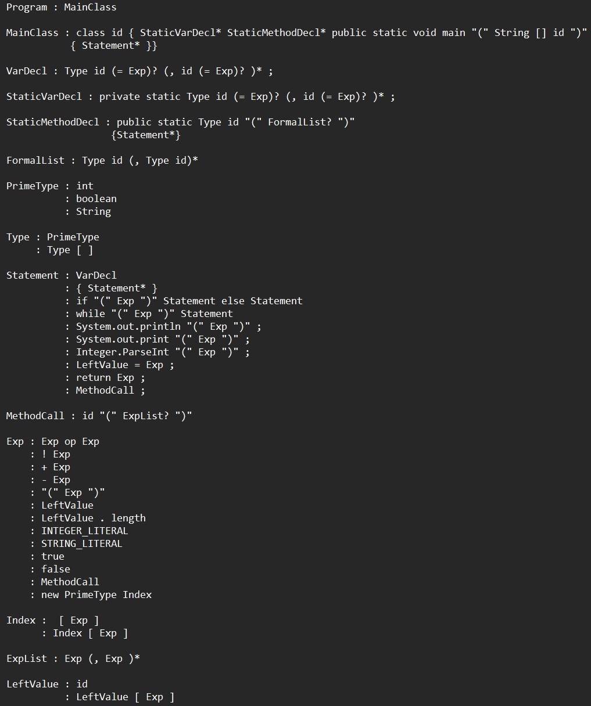

# MiniJava_Compiler
Grammar:

op contains: && || < >  <= >= == != + - * /

I run the code in raspberry pi with 32 bit arm assembly
         
For this project, it inlcudes parsing, typechecking, intermediate code generation
and optimization(register allocation) using graph coloring technique, but assuming no need to spill.
 
This project assume array will either be one or two dimension, and method will have at
most 4 arguments.
 
with_optimiztion: doesn't deal with array. 
 
without_optimization: implement all grammar rules but with many redundant ldr str instruction.
                      
